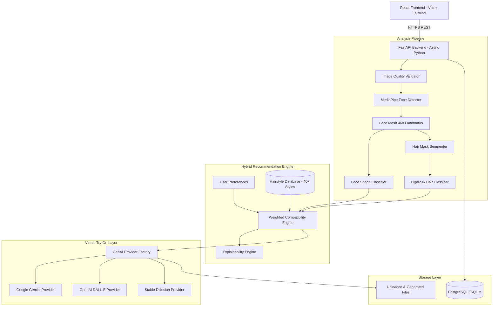

# StyleAI: AI-Powered Hairstyle Recommendation & Virtual Try-On System

[](https://opensource.org/licenses/MIT)
[](https://fastapi.tiangolo.com)
[](https://reactjs.org/)
[](https://tailwindcss.com/)
[](https://developers.google.com/mediapipe)

StyleAI is a production-quality full-stack AI platform that analyzes a user's facial geometry and hair characteristics using computer vision and machine learning, recommends flattering hairstyles through an explainable hybrid scoring engine, and generates realistic visualizations of those hairstyles on the user's photo using Generative AI.

---

## 🌟 Key Features

1. **Facial Geometry Analysis**: Uses MediaPipe Face Mesh (468 landmarks) to compute 10 scale-invariant geometric measurements and classify face shapes (**Oval, Round, Square, Oblong, Heart, Diamond**).
2. **Hair Characteristic Analysis**: Analyzes texture (**Straight, Wavy, Curly, Coily**), estimated length, density, and volume utilizing the **Figaro1k** dataset.
3. **Hybrid Recommendation Engine**: Blends facial compatibility (35%), hair texture (25%), length (10%), density (10%), user preferences (15%), and maintenance tolerance (5%) into a 0–100% suitability score.
4. **Explainable AI (XAI)**: Provides clear, natural-language reasoning (e.g., *"✓ Balances your square jawline"*, *"✓ Works well with wavy texture"*) for each recommendation.
5. **Virtual Hairstyle Try-On**: Provider abstraction supporting **Google Gemini**, **OpenAI**, and **Stable Diffusion** for identity-preserving hairstyle editing.
6. **Interactive Before/After Slider**: Draggable visual comparison tool allowing users to inspect the generated hairstyles against their original image.
7. **User Dashboard & History**: Save favorite cuts, review historical analyses, and manage profiles.
8. **Admin Management Suite**: Full CRUD catalog management for hairstyles with compatibility matrix tagging.

---

## 🏗️ Architecture



---

## 📂 Project Structure

```text
Haircut-Prediction-System/
├── backend/
│   ├── app/
│   │   ├── api/routes/         # Auth, Analysis, Recommendations, Try-On, Hairstyles
│   │   ├── core/               # Configuration, Security (JWT/bcrypt), Dependencies
│   │   ├── database/           # Async SQLAlchemy Engine, Seed Data (40+ cuts)
│   │   ├── genai/              # Provider Abstraction (Gemini, OpenAI, Stable Diffusion)
│   │   ├── ml/                 # MediaPipe Face & Hair Analysis, Scoring Engine
│   │   ├── models/             # SQLAlchemy ORM Models
│   │   ├── repositories/       # Database Query Layer
│   │   ├── schemas/            # Pydantic v2 Request/Response Schemas
│   │   ├── services/           # Business Logic Layer
│   │   └── main.py             # FastAPI App Entrypoint & Lifespan Seeder
│   ├── tests/                  # Backend Pytest Suite
│   ├── Dockerfile
│   └── requirements.txt
├── frontend/
│   ├── src/
│   │   ├── components/         # Premium UI Components, Before/After Slider, Cards
│   │   ├── hooks/              # useAuth, useAnalysis Flow State
│   │   ├── layouts/            # MainLayout (Navbar/Footer), DashboardLayout
│   │   ├── pages/              # Landing, Upload, Analysis, Preferences, Results, TryOn
│   │   ├── services/           # Axios Interceptor API Clients
│   │   └── types/              # TypeScript Interfaces
│   ├── Dockerfile
│   ├── nginx.conf
│   └── package.json
├── ml/
│   ├── datasets/               # Dataset storage and cache
│   ├── evaluation/             # Classification metrics, IoU, confusion matrices
│   ├── preprocessing/          # Landmark feature extractors & augmentations
│   ├── saved_models/           # Exported PyTorch/Scikit-learn model weights
│   └── training/               # Figaro1k download and training pipelines
├── docs/                       # Architecture, API, ML Pipeline & Deployment docs
├── docker-compose.yml          # Multi-container orchestration (Postgres, Backend, Frontend)
└── README.md
```

---

## 🚀 Getting Started

### Option A: Docker Compose (Recommended)

1. Clone the repository:
   ```bash
   git clone https://github.com/Dasun-Git-2003/Haircut-Prediction-System.git
   cd Haircut-Prediction-System
   ```
2. Set up environment variables:
   ```bash
   cp backend/.env.example backend/.env
   ```
3. Start all services:
   ```bash
   docker-compose up --build
   ```
4. Access the web interface at `http://localhost:3000` and the API docs at `http://localhost:8000/docs`.

---

### Option B: Local Setup

#### Backend Setup
```bash
cd backend
python -m venv venv
# Windows:
.\venv\Scripts\activate
# Linux/macOS:
source venv/bin/activate

pip install -r requirements.txt
uvicorn app.main:app --reload --port 8000
```

#### Frontend Setup
```bash
cd frontend
npm install
npm run dev
```
Open `http://localhost:5173` in your browser.

---

## 🧪 Testing

Run backend test suite:
```bash
cd backend
pytest -v
```

---

## 📊 Dataset Attribution

This project is configured to train its hair segmentation and classification models on the **Figaro1k** dataset:
- **Source**: [nobg/figaro1k on HuggingFace](https://huggingface.co/datasets/nobg/figaro1k)
- **Content**: 1,050 photos with pixel-level hair segmentation masks across 7 hairstyle categories (*straight, wavy, curly, kinky, braids, dreadlocks, short-men*).
- **License**: MIT

To download the dataset locally, run:
```bash
python ml/training/download_figaro1k.py
```

---

## 📄 Documentation

- [Detailed Architecture](docs/architecture.md)
- [REST API Specifications](docs/api.md)
- [Machine Learning & Figaro1k Pipeline](docs/ml.md)
- [Deployment Guide](docs/deployment.md)

---

## ⚖️ License & Ethical Disclaimer

This project is licensed under the **MIT License**.

> **Note on Face & Hair Analysis**: Face shapes and hairstyle recommendations are probabilistic aesthetic heuristics. StyleAI provides styling guidance and virtual visualizations; it does not claim objective medical or anatomical certainty. User photographs are handled strictly for local/session processing and are never retained for third-party training without explicit consent.
