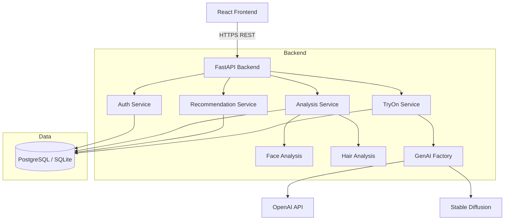

# System Architecture

## Overview
StyleAI uses a modern stack comprising a React frontend, a FastAPI Python backend, PyTorch-based ML modules, and GenAI integrations.

## Mermaid Architecture

```mermaid
graph TD
    Client[React Frontend] -->|HTTPS REST| API[FastAPI Backend]
    
    subgraph Backend
        API --> Auth[Auth Service]
        API --> Analysis[Analysis Service]
        API --> Rec[Recommendation Service]
        API --> TryOn[TryOn Service]
        
        Analysis --> ML1[Face Analysis]
        Analysis --> ML2[Hair Analysis]
        
        TryOn --> GenAI[GenAI Factory]
    end
    
    subgraph Data
        Auth --> DB[(PostgreSQL / SQLite)]
        Analysis --> DB
        Rec --> DB
        TryOn --> DB
    end
    
    GenAI --> OpenAI[OpenAI API]
    GenAI --> StableDiffusion[Stable Diffusion]
```
