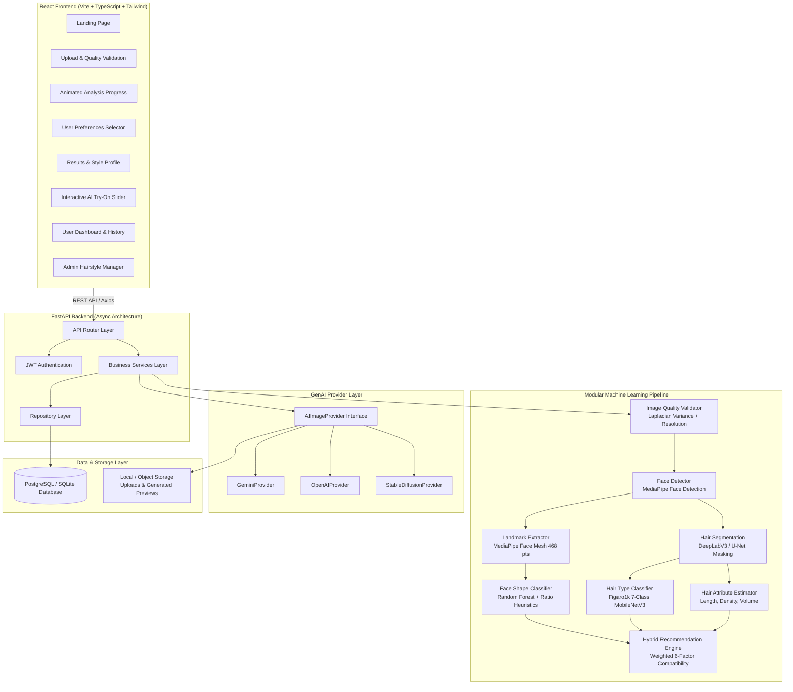

# System Architecture: StyleAI

## 1. Architectural Overview

StyleAI is a full-stack, AI-powered hairstyle recommendation and virtual try-on web application designed for explainability, modularity, and high-performance visual processing.

The core design principle separates **Recommendation** (produced via Computer Vision, Geometric Feature Extraction, ML classification, and Hybrid scoring) from **Visualization** (powered by Generative AI image editing).

---

## 2. Core Subsystems

### 2.1 Computer Vision & Face Geometry
1. **Validation**: Laplacian blur variance calculation (rejects images below threshold 100), dimensions check (minimum 200x200), single-face verification.
2. **MediaPipe Face Mesh**: 468 landmark points are used to calculate 10 scale-invariant facial ratios:
   - `face_length` (trichion / landmark 10 to gnathion / landmark 152)
   - `forehead_width` (landmarks 70 to 300)
   - `cheekbone_width` (zygomatic arches / landmarks 234 to 454)
   - `jaw_width` (gonion points / landmarks 172 to 397)
   - `chin_width` (landmarks 202 to 422)
   - `aspect_ratio`, `jaw_ratio`, `forehead_ratio`, `cheekbone_ratio`
3. **Face Shape Classification**: Distinguishes between **Oval**, **Round**, **Square**, **Oblong**, **Heart**, and **Diamond** using Random Forest models or rule-based geometric boundaries.

### 2.2 Hair Analysis & Figaro1k Integration
- Utilizes the **Figaro1k** dataset (1,050 photographs with pixel-level hair segmentation masks and 7 hairstyle classes: *straight, wavy, curly, kinky, braids, dreadlocks, short-men*).
- Outputs hair texture, estimated length, density (low/medium/high), and volume.

### 2.3 Hybrid Recommendation Engine
Calculates a multi-factor compatibility score normalized to 0–100%:
$$\text{Score} = 0.35 \cdot S_{\text{face}} + 0.25 \cdot S_{\text{hair}} + 0.10 \cdot S_{\text{length}} + 0.10 \cdot S_{\text{density}} + 0.15 \cdot S_{\text{preference}} + 0.05 \cdot S_{\text{maintenance}}$$

Each recommendation includes explainable bullet points describing why the hairstyle matches the user's facial geometry and hair type.

### 2.4 Generative AI Provider Abstraction
The `AIImageProvider` interface allows plugging in different providers:
- **Google Gemini**
- **OpenAI DALL-E / GPT-4o**
- **Stable Diffusion** (Automatic1111 / ComfyUI img2img with inpainting masks)

Controlled dynamically via the `GENAI_PROVIDER` environment variable.
